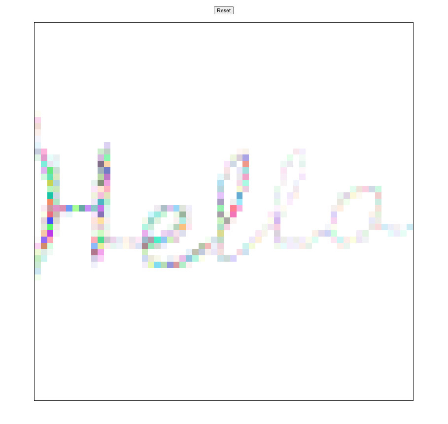

# Etch-A-Sketch

A browser-based **Etch-a-Sketch** built with **Vanilla JavaScript**, **HTML**, and **CSS**, created as part of **The Odin Project Foundations** curriculum.

This project focuses on practicing **DOM manipulation**, **event handling**, and **Flexbox** by dynamically generating an interactive drawing grid.

## Features

### 🎨 Interactive Drawing Canvas

By default, the canvas consists of a **16 × 16** grid.

As you move your cursor over a square:

* The square is assigned a **random RGB color** on the first hover.
* The initial opacity is **10%**.
* Every subsequent hover over the same square increases its opacity by **10%** while preserving the original color.
* After ten passes, the square reaches **100% opacity**.

This creates a gradual "painting" effect that encourages layering and experimentation.

### 🔲 Adjustable Grid Size

Click the **Reset** button to generate a new canvas with a custom grid size.

You can enter any value up to **100**, creating grids from **1 × 1** to **100 × 100**.

For example:

* `16` → 16 × 16 grid
* `64` → 64 × 64 grid
* `100` → 100 × 100 grid

Higher grid densities allow for much more detailed pixel art and drawings.

## Screenshot

## What I Learned

This project gave me hands-on experience with:

* Dynamically creating DOM elements with JavaScript
* Using Flexbox to build responsive grid layouts
* Handling mouse events
* Managing application state through data attributes
* Manipulating colors and opacity with JavaScript
* Structuring JavaScript into reusable functions

## Future Improvements

Although the current version fulfills the project requirements, I see a lot of potential to turn it into a fun and creative drawing application—especially for kids. Some ideas I'd love to implement include:

* **Click-and-drag drawing**

  * Instead of drawing whenever the cursor enters a square, users would draw only while holding down the left mouse button, providing much finer control.

* **Save and share artwork**

  * Allow users to save their creations as images or share them with others.

* **Color palette**

  * Let users choose their own drawing colors instead of using randomly generated ones.

* **Templates for kids**

  * Provide outline templates (animals, flowers, cartoon characters, geometric shapes, etc.) that children can trace and color in, turning the project into an interactive digital coloring book.

* **Additional drawing tools**

  * Eraser
  * Rainbow mode
  * Shading mode
  * Fill bucket
  * Clear canvas
  * Undo / Redo

## A Personal Note

As this project grew, I realized it could become much more than a coding exercise. As a mom, I know how much kids enjoy drawing, coloring, and creating. I'd love to continue developing this project into a playful digital art playground where children can freely explore their creativity while having fun.